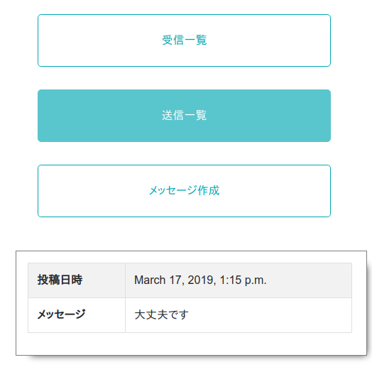
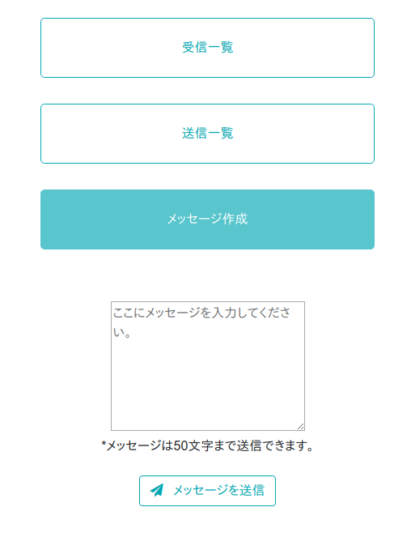

# みつける君

災害時にはぐれた子供や家族を探すプロダクト  

トップ画面  
  
受信一覧  
  
送信一覧  
  
送信画面  

## Dependency

- Django 2.1
- django-bootstrap4 0.0.7
- Python 3.6.5
- Arduino 1.8.7

## Setup

- 上記の環境を構築してDjangoでアプリを作成してください。
- M5Stackにm5stack_program.inoをコンパイルしてください。

## Author
- lanqiu  
Web全体のデザインを担当
- NishiYuki  
Arduinoプログラムの担当
- Masapyon（大浦雅也）  
DB、システム設計（Python）
