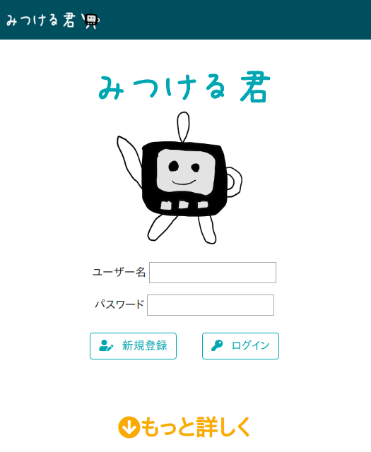
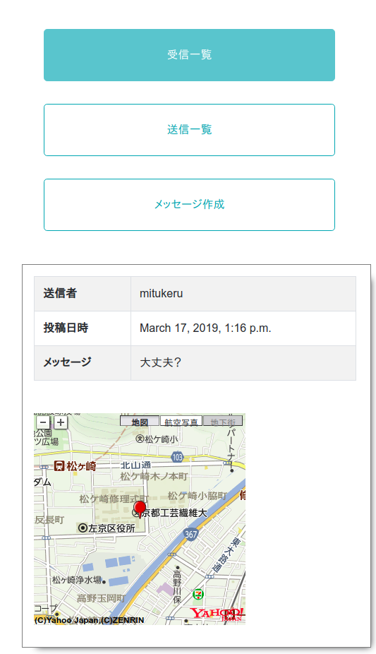

# みつける君

災害時にはぐれた子供や家族を探すプロダクト  

トップ画面  
  
受信一覧  
  
送信一覧  
  
送信画面  

## Dependency

- Django 2.1
- django-bootstrap4 0.0.7
- Python 3.6.5
- Arduino 1.8.7

## Setup

- M5Stack

## Author

- lanqiu
- Masapyon
- NishiYuki
